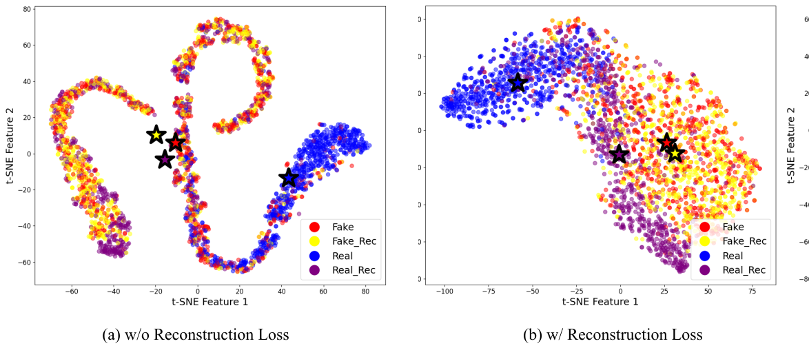

# Diffusion-Generated Image Detection

## Introduction
This project focuses on detecting diffusion-generated images using a robust dual loss learning approach. Inspired by recent research (DRCT), I applied a margin-based contrastive loss to perform contrastive learning between original and reconstructed images. This method helps the model effectively classify difficult samples, contributing to the development of a more generalized detector.

## Dual Loss Learning
Real and fake images were reconstructed using a stable diffusion inpainting model. I then extracted 1024-dimensional embeddings from the layer before the fully connected (FC) layer of ConvNeXt-base. Contrastive loss and reconstruction loss were calculated from these embeddings. The dual loss function is defined as follows:

```math
L_{dual} = L_{contrastive} + \lambda L_{recon}
```

where $\lambda$ is the weight applied to the reconstruction loss, set to $0.05$. Dual loss is combined with binary cross-entropy loss to enhance the ability of ConvNeXt to distinguish between fake and real images.

## Contrastive Loss
The contrastive loss follows the equation:

```math
L_{contrastive} = \frac{1}{N_{pos}} \sum_{(i,j) \in P} \left(1 - \text{dist}(z_i, z_j)\right)^2 + \frac{1}{N_{neg}} \sum_{(i,j) \in N} \max \left( \text{dist}(z_i, z_j) - m, 0 \right)^2
```

where $N_{pos}$ is the number of positive pairs, $P$ represents the positive pairs set, $N_{neg}$ is the number of negative pairs, and $N$ represents the negative pairs set. The distance metric $\text{dist}$ defaults to Manhattan distance.

Positive pairs consist of real reconstructed images, fake images, and fake reconstructed images, while negative pairs only include real images. As a result, the model learns to distinguish real reconstructed images more effectively from real images, leading to higher accuracy.

## Reconstruction Loss
The reconstruction loss is designed to increase the distance between real images and their reconstructions while reducing the distance between fake images and their reconstructions. It serves two main purposes:
1. Enhancing the training process efficiency.
2. Regulating the distance between real reconstructed images and fake reconstructed images.

By complementing contrastive loss, reconstruction loss accelerates training. Without it, training required over $15$ epochs, whereas adding reconstruction loss reduced the necessary epochs to fewer than $5$. Furthermore, if real reconstructed images and fake images become too similar, the model may overfit to the training data, degrading performance on images generated by different models. Since diffusion models differ in their generated image distributions, maintaining an appropriate distance via reconstruction loss improves generalization performance.

The reconstruction loss is defined as:

```math
L_{recon} = \frac{1}{N} \sum_i \max \left( \| x_i - \hat{x}_i \|_2^2 - \| y_i - \hat{y}_i \|_2^2 + \gamma, 0 \right)
```

where $N$ is the number of samples, and all image embeddings are normalized. $\gamma$ ensures a sufficient difference between real and fake reconstruction errors.

<p align="center"></p>

The figure above compares embedding distances before and after applying reconstruction loss. In (a), where only contrastive loss was used, the embeddings of three image types (real reconstructed images, fake images, and fake reconstructed images) are closely positioned. However, after adding reconstruction loss, as shown in (b), real reconstructed images maintain a slight distance from the other two types. The accuracy on the GenImage dataset increased from **77.18\%** (contrastive loss only) to **81.01\%**, demonstrating the significance of reconstruction loss.

## Performance Comparison

The tables below present a performance comparison across different generative models.

#### Table 1: Detection Performance on GenImage dataset, trained on GenImage/SD1.4

| Model  | SD1.4  | SD1.5  | Midjourney | ADM   | Wukong | Glide  | VQDM   | BigGAN  | Average  |
|--------|------:|------:|-----------:|------:|-------:|------:|------:|------:|--------:|
| ConvB  | 0.9998 | 0.9990 | 0.7927  | 0.5155 | 0.9975 | 0.5689 | 0.5584 | 0.4999 | 0.7415  |
| DRCT   | 0.9978 | 0.9976 | 0.8862  | 0.5735 | 0.9976 | 0.5584 | 0.6221 | 0.5409 | 0.7718  |
| **Ours**  | **0.9968** | **0.9959** | **0.8952** | **0.6407** | **0.9968** | **0.6663** | **0.7843** | **0.6372** | **0.8267** |

#### Table 2: Detection Performance on UniversalFakeDetect dataset, trained on GenImage/SD1.4

| Model  | DALLE | Glide_50_27 | Glide_100_10 | Glide_100_27 | Guided | LDM_100 | LDM_200_CFG | LDM_200 | Average  |
|--------|------:|------------:|-------------:|-------------:|-------:|--------:|------------:|--------:|--------:|
| ConvB  | 0.754 | 0.5715      | 0.5855       | 0.562        | 0.5295 | 0.9975  | 0.993       | 0.9975  | 0.7488  |
| DRCT   | 0.72  | 0.5725      | 0.6025       | 0.5765       | 0.64   | 0.994   | 0.991       | 0.9935  | 0.7613  |
| **Ours**  | **0.89**  | **0.7125**  | **0.7745**  | **0.734**  | **0.742**  | **0.9855**  | **0.976**  | **0.9845**  | **0.8499**  |


## Conclusion
This project implements a dual loss learning approach to improve the detection of diffusion-generated images. By integrating contrastive loss with reconstruction loss, the model effectively generalizes to various generative models. The approach not only improves accuracy but also accelerates training, making it practical for real-world applications.

This code is based on [DRCT](https://github.com/beibuwandeluori/DRCT.git).


## How to Run

### Environment Setup

- **Dependencies Installation**
  - `pip install -r requirements.txt`

- **Prerequisite:** Make reconstruction images (use data/diffusion_rec.py)
  
### Run the Project (For training)

```
bash train_bash/train1.sh experiment1
```

